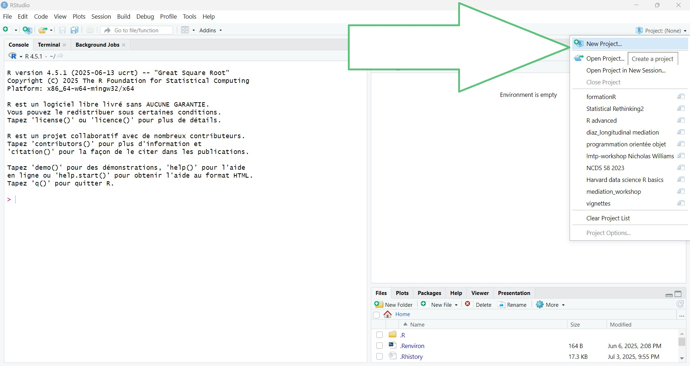
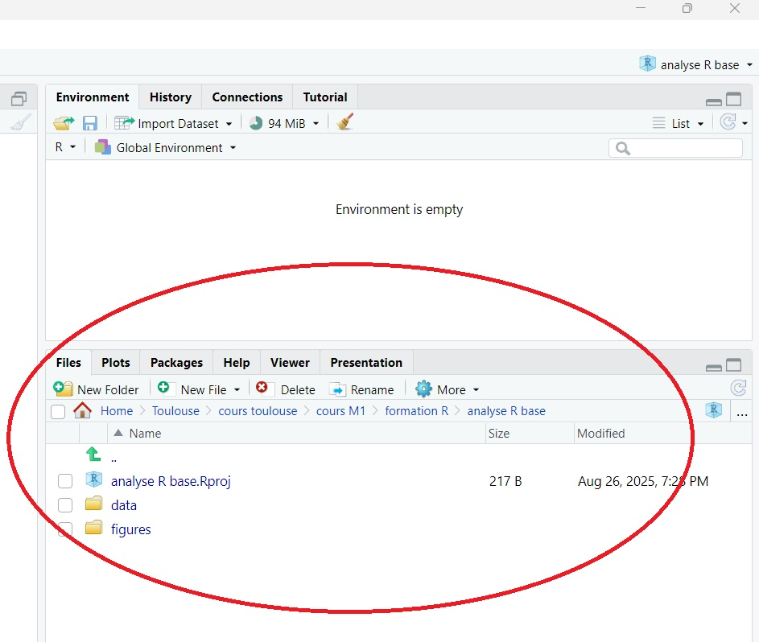
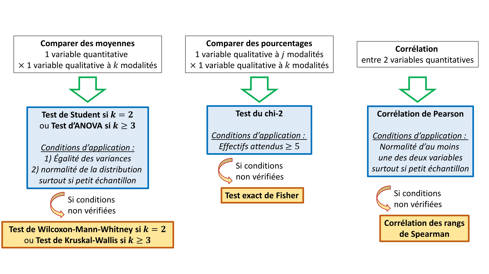

# Analyse simple en R base

Dans ce chapitre, nous allons analyser une base de données simple en utilisant les commandes de R base. 

Les objectifs de ce chapitre sont de : 

  - **préparer un dossier (et un environnement) de travail** pour réaliser les analyses
  - **importer des données**, **créer des variables**, **modifier une variable déjà existante**
  - réaliser des **analyses descriptives univariées** des variables quantitatives et qualitatives
  - réaliser des **analyses descriptives bivariées** 
  - faire des **représentations graphiques** des données
  - savoir faire les **tests statistiques de comparaison** de moyennes et de pourcentages
  - savoir faire une **modèle de régression linéaire multivariée**, et vérifier ses conditions d'application
  - **sauvegarder** les données et les résultats

_Note : Nous verrons dans les chapitre suivants comment réaliser la même analyse en utilisant : _

  - _des packages spécifiques qui facilitent la réalisation et la présentation des analyses._
  - _la collection de packages du `tidyverse` qui apportent de nouvelles fonctions avec une nouvelle philosophie, une nouvelle grammaire et de nouvelles structures de données, qui est très utilisé dans la communauté des utilisateurs de R._
  
## Préparer un dossier de travail
### Projet R
**1ère étape : Créer un dossier de travail.** Commencez par créer un dossier vide, appelé _analyse R base_ dans l'endroit de votre choix sur votre ordinateur. Au sein de ce dossier, vous pouvez ajouter un dossier _data_ et un dossier _figures_ qui pourra vous servir à stocker les données et les figures que vous souhaitez souvegarder.

**2ème étape : Créer un projet R.** Dans R Studio, cliquez sur le cube en 3 dimensions R "Project: (None)" en haut à droite, au dessus du cadran environnement. 

  - puis "New Project...".
  - choisissez "Existing Directory...". Avec le bouton browse, vous pouvez alors rechercher le dossier _analyse R base_ que vous venez de créer à la 1ère étape.
  - enfin cliquez sur "Open" et "Create Project".
```{r newsproject1, echo=FALSE, out.width="100%", fig.align="center"}
  
```

<!-- , fig.cap="Créer un nouveau projet" -->
R Studio va alors créer un fichier `analyse R base.Rproj` au sein de votre dossier _analyse R base_. De plus, ce dossier _analyse R base_ sera défini comme votre dossier de travail au sein de R Studio. 

Ainsi si vous demandez à R quel est votre dossier de travail actuel avec la commande `getwd()` (_get working directory_), la console va indiquer le chemin jusque ce dossier (R vous confirme qu'il s'agit bien de votre dossier de travail !). 

Le contenu de ce dossier de travail apparaît également dans le menu "Files" dans le cadrant en bas à droite. Ce dossier sert de "dossier racine" ("répertoire racine"). Les fichiers au sein de ce dossier pourront être désignés avec un chemin raccourci. **Tous les éléments que vous allez sauvegarder pendant votre session R Studio seront sauvegardés dans ce dossier de travail +++**
```{r workingdir, echo=FALSE, out.width="75%", fig.align="center"}
  
```
<!-- , fig.cap="Dossier de travail" -->
Si vous ouvrez un nouveau script R et que vous le sauvegardez (par exemple, sous le nom `1_analyse en R base`), il sera ajouté par défaut au sein de votre dossier de travail, et va apparaître parmi les fichiers du menu file (cadrant en bas à droite).

Maintenant, **quittez le programme R Studio**, puis **double cliquez sur le fichier `analyse R base.Rproj`** (icone d'un cube R en 3 dimensions) qui vient d'être créé dans votre dossier de travail "analyse R base". 

R Studio va alors s'ouvrir, en ayant directement défini le dossier _analyse R base_ comme dossier de travail. C'est la méthode la plus simple pour reprendre une analyse R en cours et pour reproduire les résultats déjà obtenus.

### Structurer un script d'analyse
Lorsque vous réaliserez une analyse, vous allez **sauvegarder vos commandes dans un script** (par exemple, dans le script `1_analyse en R base.R` que l'on vient de sauvegarder précédemment).

En haut du script, si vous souhaitez recommencer à partir d'un environnement vide lorsque vous relancerez l'analyse depuis le départ, vous pouvez ajouter la commande `rm(ls = list())`. 

Une bonne pratique est d'indiquer quelques informations utiles pour documenter votre script, comme votre **nom et la date des analyses (en commentaires)**. Enfin, à la fin d'un script (à la fin de vos analyses), vous pouvez lancer la commande `sessionInfo()` qui va lister dans la console la version de R et les versions des packages qui ont été utilisés pour votre analyse (vous pourrez copier ces informations à la fin de votre script, en commentaires).

Les commentaires peuvent également servir à indiquer des **titres** et **sous-titres** dans votre script d'analyse. Un menu d'accès rapide est alors accessible à partir du bouton _Outline_ en haut à droite de la fenêtre du script R. 

_Note : sur windows, le raccourci "ctrl-shift-c" transforme les lignes sélectionnées en commentaires (en ajoutant automatiquement des `#` en début de ligne)_

Voici un exemple de script qui suit cette structure :
```{r exscript, eval=FALSE, include=TRUE}
### 1_analyse en R base
### Date : 15 septembre 2025 
### Auteur : Timoté Chalamais

rm(list = ls()) # cette commande vide le contenu de l'environnement

# ---------------------------------------------------------------------------- #
# 1) Titre n°1 (il faut ajouter 4 tirets à la fin des titres) ----
## 1.2) Sous-titre (en ajoutant un # au début de ligne) ----
### 1.2.1) Sous-sous-titre (en ajoutant des # supplémentaires) ---- 
# ---------------------------------------------------------------------------- #

# Import des données
df_1 <- read.csv2("data/df_1.csv")
meta_df_1 <- read.csv2("data/meta_df_1.csv")

# ---------------------------------------------------------------------------- #
# 2) Titre n°2  ----
# ---------------------------------------------------------------------------- #
head(df_1)

(...) # continuez vous analyses
(...)

# ---------------------------------------------------------------------------- #
# Fin de script  ----

# à la fin, vous pouvez récupérer les informations sur la session 
# pour les copier-coller en bas du script (en format de commentaires)
sessionInfo()
# R version 4.5.1 (2025-06-13 ucrt)
# Platform: x86_64-w64-mingw32/x64
# Running under: Windows 11 x64 (build 26100)
# 
# Matrix products: default
#   LAPACK version 3.12.1
# 
# locale:
# [1] LC_COLLATE=French_France.utf8 
# [2] LC_CTYPE=French_France.utf8   
# [3] LC_MONETARY=French_France.utf8
# [4] LC_NUMERIC=C                  
# [5] LC_TIME=French_France.utf8    
# 
# time zone: Europe/Paris
# tzcode source: internal
# 
# attached base packages:
# [1] stats     graphics  grDevices utils     datasets 
# [6] methods   base     
# 
# loaded via a namespace (and not attached):
#  [1] compiler_4.5.1    bookdown_0.43    
#  [3] fastmap_1.2.0     cli_3.6.5        
#  [5] htmltools_0.5.8.1 tools_4.5.1      
#  [7] rstudioapi_0.17.1 yaml_2.3.10      
#  [9] rmarkdown_2.29    knitr_1.50       
# [11] xfun_0.52         digest_0.6.37    
# [13] rlang_1.1.6       evaluate_1.0.4 
```


## Importer une base de données
Pour cet exemple, 

  - téléchargez la base [`df_1.csv`](https://github.com/benoitlepage/formationR/blob/main/data/df_1.csv) ainsi que la base de méta-données [`meta_df_1.csv`](https://github.com/benoitlepage/formationR/blob/main/data/meta_df_1.csv) (cliquez sur le bouton _download raw file_, à droite avec une flèche vers le bas). 
  - Vous pouvez ensuite coller ces deux bases de données au sein du dossier _data_ de votre dossier de travail.

Il s'agit de fichiers avec l'extension ".csv" (_comma separated variables_) où les valeurs sont séparées par un point virgule. Vous pouvez les importer dans R avec la fonction `read.csv2()` (il existe également une fonction `read.csv()` qui importe les données .csv où le séparateur est une virgule). Vous pouvez regarder les différents arguments de ces fonctions dans l'aide `?read.csv2`.

Nous allons stocker la base dans des objets nommés `df_1` et `meta_df_1`. Ces bases importées sont des objets de type `data.frame`.
```{r importcsv, eval=FALSE, include=TRUE}
df_1 <- read.csv2("data/df_1.csv")
meta_df_1 <- read.csv2("data/meta_df_1.csv")
class(df_1)  # [1] "data.frame"
```

```{r importcsv2, include=FALSE}
df_1 <- read.csv2("data/df_1.csv")
meta_df_1 <- read.csv2("data/meta_df_1.csv")
```

  - La base `df_1` contient les données que nous allons analyser.
  - La base `meta_df_1` contient des méta-données (noms de variables, noms des labels, etc) qui sera utile pour préciser les noms des variables, les labels des variables qualitatives, etc.

## Examiner les données et les méta-données
Comme vu précédemment, vous pouvez examiner les données avec les fonctions `head()`, `tail()`, `str()` et `View()`.

```{r view1, echo=TRUE}
head(df_1)
tail(df_1)
str(df_1)
```

```{r view3, eval=FALSE, include=TRUE}
View(df_1) # pour voir la base de données dans R Studio
```
On voit que la base de données contient 300 observations et 5 variables : 

  - `subjid`, l'identifiant patient
  - `sex`, le sexe du patient
  - `imc`, l'indice de masse corporelle du patient (en kg/m2)
  - `trait`, le traitement 0 = placebo, 1 = traitement A, 2 = traitement B
  - `pas`, la pression artérielle systolique (en mmHg)
  
Toutes les variables dans `df_1` sont de type entier (`int`) ou réel (`num`).

```{r view2, echo=TRUE}
meta_df_1 # pour regarder le contenu des méta-données : 
```
La base de méta-données contient 5 variables : 

  - `var`, nom des variables que l'on retrouve dans la base de données `df_1` 
  - `label`, nom en détail de la variable  
  - `id_labs`, un identifiant pour les labels éventuels, par variable
  - `code_labs`, codage numérique du label (code utilisé dans la base `df_1`) 
  - `labs`, modalités de réponses des variables qualitatives, en détail


## Créer ou modifier une variable
### Créer des variables
Nous allons créer une variable `obesite` dont la valeur est égale à 1 si l'indice de masse corporelle est $\geq 30\text{ kg/m}^2$ et égale à 0 sinon.

Pour cela, on peut utilise la fonction `ifelse()` dont le premier argument est une condition, le 2ème argument est la valeur à retourner si la condition est vraie, et le 3ème argument est la valeur à retourner si la condition est fausse.
```{r create_var1, echo=TRUE}
df_1$obesite <- ifelse(df_1$imc >= 30, 1, 0)
```
Chaque fois que vous créez ou modifiez une variable, il est utile de vérifier que vous n'avez pas fait d'erreurs. Dans cet exemple, on peut vérifier quelles sont les valeurs minimales et maximales de l'indice de masse corporelle au sein des deux catégories de la nouvelle variable : 
```{r create_verif1, eval=FALSE, include=TRUE}
### vérifier que la variable est correctement crée : 
min(df_1$imc[df_1$obesite == 0]) # [1] 15.4
max(df_1$imc[df_1$obesite == 0]) # [1] 29.9
### les valeurs d'IMC varient de 15.4 à 29.9 lorsque obesite == 0

min(df_1$imc[df_1$obesite == 1]) # [1] 30.1
max(df_1$imc[df_1$obesite == 1]) # [1] 32.5
### les valeurs d'IMC varient de 30.1 à 32.5 lorsque obesite == 1 => c'est bon !
```

Nous allons ensuite créer une variable d'IMC en classes (`imc_cl`) définie telle que : 
 
  - `imc_cl = 1` (maigreur) si l'IMC < 18.5 kg/m$^2$,
  - `imc_cl = 2` (normal) si l'IMC $\geq 18.5 \text{ kg/m}^2$ et IMC $< 25 \text{ kg/m}^2$,
  - `imc_cl = 3` (normal) si l'IMC $\geq 25 \text{ kg/m}^2$ et IMC $< 30 \text{ kg/m}^2$,
  - `imc_cl = 4` (normal) si l'IMC $\geq 30 \text{ kg/m}^2$.
  
Il y a plusieurs possibilités pour créer cette variable, voici 3 méthodes différentes : 
```{r create_var2, echo=TRUE}
### 1) créer une variable où toutes les données sont manquantes : 
df_1$imc_cl <- rep(NA, nrow(df_1))
###    puis remplacer les données manquantes par les valeurs souhaitées
df_1$imc_cl[df_1$imc < 18.5] <- 1
df_1$imc_cl[df_1$imc >= 18.5 & df_1$imc < 25] <- 2
df_1$imc_cl[df_1$imc >= 25 & df_1$imc < 30] <- 3
df_1$imc_cl[df_1$imc >= 30] <- 4

### 2) avec la fonction ifelse de manière itérative : 
df_1$imc_cl <- ifelse(df_1$imc < 18.5, 1, 
                      ifelse(df_1$imc >= 18.5 & df_1$imc < 25, 
                             2, ifelse(df_1$imc >= 25 & df_1$imc < 30, 3, 4)))

### 3) avec une formule intégrant des conditions.
###    Comme on multiplie les résultats de conditions à des entiers, les 
###    réponses TRUE et FALSE sont transformées en 1 et 0 par coercition
df_1$imc_cl <- (1 * (df_1$imc < 18.5) + 
                  2 * (df_1$imc >= 18.5 & df_1$imc < 25) + 
                  3 * (df_1$imc >= 25 & df_1$imc < 30) + 
                  4 * (df_1$imc >= 30))
```
Pensez à vérifier que vous n'avez pas fait d'erreur en créant cette variable. Par exemple, on peut vérifier la distribution de l'IMC au sein des 4 classes à l'aide d'un box plot.
```{r create_verif2, echo=TRUE}
boxplot(df_1$imc ~ df_1$imc_cl) # imc en fonction de l'imc en classe
```

Après avoir créé ces deux nouvelles variables, nous pouvons compléter la base de méta-données pour définir les noms de variables et de labels en clair. Pour cela, nous allons ajouter des lignes supplémentaires avec la fonction `rbind()` (_row bind_ pour "fusion par rang"). _A noter qu'il existe aussi une fonction `cbind()` qui permet de fusionner des bases ou des matrices par colonnes_
```{r create_var3, echo=TRUE}
meta_df_1 <- rbind(meta_df_1, 
                   data.frame(var = c(rep("obesite", 2), 
                                      rep("imc_cl", 4)),
                              label = c(rep("Obésité", 2), 
                                        rep("IMC en classes", 4)),
                              id_labs = c(1:2, 1:4),
                              code_labs = c(0:1, 1:4),
                              labs = c("Non", "Oui",
                                       "Maigreur", "Normal", "Surpoids", "Obèse"))
                   )
meta_df_1
```

### Modifier des variables
Enfin, nous souhaitons modifier la valeur de la pression artérielle du patient n°137 : suite à une erreur de saisie, nous nous sommes rendu compte que sa valeur n'est pas 133 mmHg, mais 123 mmHg.
```{r modify_var1, echo=TRUE}
df_1$pas[df_1$subjid == 137]

## nous pouvons directement assigner la nouvelle valeur avec l'indexation par 
## condition :
df_1$pas[df_1$subjid == 137] <- 123
df_1[df_1$subjid %in% 135:140,] 
# on voit que la valeur du patient 137 a bien été corrigée
```

## Analyses univariées
### fonction `summary()`
Nous pouvons utiliser la fonction `summary()` pour obtenir de manière synthétique une description univariée de l'ensemble des variables, indiquant : les valeurs minimales et maximales, quartiles et médiane, et la valeur moyenne. 
```{r summary1, echo=TRUE}
summary(df_1)
```
Les variables de la base `df_1` sont toutes codées en valeurs numériques, la fonction summary a donc décrit les variables qualitatives comme s'il s'agissait de variables quantitatives : ce n'est pas adapté.

Nous allons créer 2 nouvelles variables en `factor` à partir des variables qualitatives. Pour cela, nous allons également nous servir des informations indiquées dans la base de méta-données. Puis nous allons relancer la fonction `summary()` : 
```{r summary2, echo=TRUE}
### création de 2 variables de type "factor" à partir des variables sex et trait
df_1$sexL <- factor(df_1$sex,
                    labels = meta_df_1$labs[meta_df_1$var == "sex"])
df_1$traitL <- factor(df_1$trait,
                      labels = meta_df_1$labs[meta_df_1$var == "trait"])
summary(df_1)
```
Les nouvelles variables `sexL` et `traitL` sont à présent décrites par dénombrement du nombre d'individus par modalité de réponse, de manière adaptée aux variables qualitatives.

### Variables quantitatives
Pour décrire des variables quantitatives, on peut s'intéresser aux paramètres suivants : 

  - effectifs observés (non-manquants), avec les fonctions `length()` qui indique la longueur d'un vecteur, ou `nrow()` qui indique le nombre de lignes d'une base de données (ou d'une matrice)
  - moyenne, avec la fonction `mean()`
  - écart type et variance, avec les fonctions `sd()` et `var()`
  - minimum, 1er quartiles, médiane, 3ème quartile, maximum, avec les fonctions `min()`, `max()`, `median()`, `quantiles()`
```{r desc_univ_quanti1, eval=FALSE, include=TRUE}
### Effectifs observés : 
### Comme il n'y a pas de manquant dans cette base, on peut directement utiliser
### la fonction length() ou nrow() pour connaître les effectifs 
nrow(df_1) # 300
length(df_1$imc) # 300

### Pour compter les effectifs non-manquants, de manière explicite :
length(df_1$imc[!is.na(df_1$imc)]) # 300

### moyennes
mean(df_1$imc, na.rm = TRUE) # 24.481
mean(df_1$pas, na.rm = TRUE) # 137.1133

### déviation standard (écart-type)
sd(df_1$imc, na.rm = TRUE) # 3.069072
sd(df_1$pas, na.rm = TRUE) # 16.82053

### variances
var(df_1$imc, na.rm = TRUE) # 9.419203
var(df_1$pas, na.rm = TRUE) # 282.9303

### quantiles
min(df_1$imc, na.rm = TRUE) # 15.4
min(df_1$pas, na.rm = TRUE) # 92

max(df_1$imc, na.rm = TRUE) # 32.5
max(df_1$pas, na.rm = TRUE) # 177

median(df_1$imc, na.rm = TRUE) # 24.6
median(df_1$pas, na.rm = TRUE) # 138

quantile(df_1$imc, probs = c(0, 0.25, 0.5, 0.75, 1), na.rm = TRUE)
#   0%  25%  50%  75% 100% 
# 15.4 22.3 24.6 26.4 32.5
quantile(df_1$pas, probs = c(0, 0.25, 0.5, 0.75, 1), na.rm = TRUE)
  # 0%  25%  50%  75% 100% 
  # 92  125  138  149  177
```

### Programmation élémentaire 
#### Créer une nouvelle fonction
Il est fastidieux de devoir récupérer les différents paramètres de distribution de chaque variable, un par un !

Mais R permet facilement de programmer de nouvelles fonctions "maison" à l'aide de `function(arguments) { expression }`, où on indique une liste d'`arguments` entre parenthèses, puis une liste de commandes à réaliser entre les accolades. 

Par exemple, on peut créer une nouvelle fonction `exemple_fonction()` qui ajoute +2 à l'objet `x` : 
```{r ex_function, echo=TRUE}
seq_1a5 <- c(1:5)
exemple_fonction <- function(x) {return(x + 2)}
exemple_fonction(seq_1a5)
```

Pour accélérer notre analyse des variables quantitatives, nous allons créer **une nouvelle fonction qui va calculer d'un coup l'ensemble des paramètres qui nous intéressent**. Cette fonction sera nommée `univ_quanti`, elle va dépendre de 3 arguments : 

  - `x`, la variable à décrire
  - `dig`, le nombre de chiffres après la virgule pour présenter des valeurs arrondies
  - `remove_miss`, une valeur logique qui sera utilisée pour exclure (ou non) les données manquantes du calcul (pour renseigner l'argument `na.rm` des fonctions descriptives de base)
  
Entre accolades, on va demander à la fonction de : 

  - calculer les effectifs, la moyenne, l'écart type et les quantiles, de la variable `x`
  - regrouper ces valeurs au sein d'un vecteur de réels, arrondis à `dig` chiffres après la virgule, 
  - retourner le vecteur obtenu
```{r desc_univ_quanti2, echo = TRUE}
### Définir une nouvelle fonction dans R
univ_quanti <- function(x, # la variable à décrire
                        dig = 2, # par défaut, 2 chiffres après la virgule
                        remove_miss = TRUE # par défaut, la valeur est TRUE
                        ) { # fermez la parenthèse et ouvrez l'accolade
  # on commence par calculer les différents paramètres et on les stocke dans 
  # les objets : "n", "moy", "sd" et "q"
  n <- length(x[!is.na(x)])     
  moy <- mean(x, na.rm = remove_miss)
  sd <- sd(x, na.rm = remove_miss)
  q <- quantile(x, probs = c(0, 0.25, 0.5, 0.75, 1), na.rm = remove_miss)
  
  # on stocke les résultats dans un vecteur de réels, nommé "param",
  # en gardant uniquement la valeur arrondie pour la moyenne et l'écart-type
  param <- c(n, 
             round(moy, digits = dig), 
             round(sd, digits = dig), 
             q)
  # on peut ajouter un nom à chaque élément du vecteur "param"
  names(param) <- c("N", "mean", "sd", "min", "Q1", "median", "Q3", "max")
  
  # indiquer ce que doit retourner la fonction
  return(param) 
} # fermez l'accolade
```

Si on applique cette fonction à nos deux variables quantitatives, on obtient l'ensemble des paramètres présentés dans un vecteur : 
```{r desc_univ_quanti3, echo = TRUE}
univ_quanti(df_1$imc, dig = 1, remove_miss = TRUE)
univ_quanti(df_1$pas, dig = 1, remove_miss = TRUE)
```
_Note : Vous pouvez remarquer qu'en utilisant cette fonction, les objets `n`, `moy`, `sd`, `q` et `param` n'apparaissent pas dans l'environnement de travail, ils ont uniquement été créés de manière temporaire au sein de la fonction._


#### Utiliser des boucles
Les boucles `for` dans R permettent également d'automatiser des opérations en boucle. La syntaxe d'une boucle est : 

  - `for (variable in sequence) { expession }` où l'`expression` entre accolade est répétée chaque fois que la `variable` est égale à une valeur de la `sequence`
```{r ex_boucle1, echo=TRUE}
### exemple de boucle : 
###  - pour chaque valeur i variant de 1 à 5,
###    => calcule 20 + i
###    => ajoute cette valeur à la fin de la phrase "calcul de 20 + i = "
###    => imprime le résultat à l'écran
for (i in 1:5) {
  print(paste0("calcul de 20 + i = ", 20 + i))
}
```

On peut appliquer cette démarche pour répéter l'analyse univariée avec notre nouvelle fonction `univ_quanti()` à nos deux variables quantitatives. Les deux variables quantitatives sont dans les colonnes 3 et 5 de la base de données.
```{r ex_boucle2, echo=TRUE}
### Avec la fonction names(), on voit que les variables quantitatives imc et pas 
### sont la 3ème et la 5ème variable de la base df_1
names(df_1)
for (i in c(3, 5)) {
  print(names(df_1)[i]) # imprime le nom de la i-ème variable
  # puis imprime les résultats de la fonction univ_quanti appliquée à la i-ème
  # variable de la base df_1
  print(univ_quanti(df_1[[i]], dig = 1, remove_miss = TRUE)) 
}
```

Question bonus : que se passe t'il si vous n'indiquez pas la fonction `print()` ?

  - _réponse : il a fait tourner la fonction, mais ne l'a pas imprimé les résultats à l'écran_

#### Fonctions `apply()`, `lapply()`, `sapply()`

On peut également lancer une fonction de manière répétée appliquée :

  - à des colonnes ou des lignes de matrices (ou de data frame) avec la fonction `apply()`
  - à des vecteurs ou des listes avec `lapply()` (qui retourne les résultats sous forme de liste) ou `sapply()` (qui retourne les résultats sous forme de matrice ou de vecteur)

**Exemple 1 :** La fonction `apply()` permet d'appliquer notre fonction de description des paramètres aux colonnes `"imc"` et `"pas"` de la la base `df_1` (Le résultat sera une matrice de réels) : 
```{r apply1, echo=TRUE}
apply(df_1[,c("imc", "pas")], # matrice ou data.frame sélectionnée
      MARGIN = 2, # 2 = par colonne ;  1 = par ligne
      FUN = univ_quanti, # fonction à utiliser
      dig = 1, # on peut ajouter les arguments de la fonction à la suite
      remove_miss = TRUE) 
```

**Exemple 2 :** La fonction `lapply()` applique la fonction à une liste de vecteurs et retourne une liste de la même longueur. La fonction `sapply()` fait la même chose, mais retourne les résultats sous forme de vecteur ou de matrice.
```{r apply2, echo=TRUE}
lapply(X = df_1[,c("imc", "pas")], 
      FUN = univ_quanti,  # fonction à utiliser
      dig = 1,
      remove_miss = TRUE)
sapply(X = df_1[,c("imc", "pas")],  
       FUN = univ_quanti,  # fonction à utiliser
       dig = 1,
       remove_miss = TRUE) 
```

Si on veut remplacer les noms de colonnes par les noms de variables en clair, on peut utiliser la base de méta-données :
```{r apply3, echo=TRUE}
res_quanti <- sapply(df_1[,c("imc", "pas")],
                     FUN = univ_quanti,
                     dig = 1)
# on modifie le nom des colonne de la matrice de résultats
# avec les informations disponibles dans les méta-données
colnames(res_quanti) <- c(meta_df_1$label[meta_df_1$var == "imc"],
                          meta_df_1$label[meta_df_1$var == "pas"])
res_quanti
```

### Variables qualitatives
Pour décrire les variables qualitatives, 

  - la fonction `table()` permet de décrire les effectifs dans chaque modalité de réponse,
  - la fonction `prop.table()` permet de décrire les pourcentages des données obtenues avec la fonction `table()`,
  
On va utiliser les variables en "facteur" `sexL` et `traitL` dont les modalités de réponse sont labellisées.

```{r  desc_univ_quali1, echo=TRUE}
### Description de la variable sex
table(df_1$sexL) # retourne un vecteur avec les effectifs
prop.table(table(df_1$sexL)) # retourne un vecteur avec les pourcentages

### On peut combiner ces deux vecteurs avec cbind() (combinaison par colonne) 
### pour les afficher dans une matrice 
tab_sex <- cbind(table(df_1$sexL), 
                 round(prop.table(table(df_1$sexL)) * 100, digits = 1))
colnames(tab_sex) <- c("n", "pct")
tab_sex

### De même pour la variable traitement
tab_trait <- cbind(table(df_1$traitL), 
                   round(prop.table(table(df_1$traitL)) * 100, digits = 1))
colnames(tab_trait) <- c("n", "pct")
tab_trait
```

## Représentations graphiques
Il est toujours utile de faire des représentations graphiques de la distribution des variables : cela permet d'avoir une bonne vision de l'ensemble des données et de détecter des anomalies éventuelles.

### Distributions univariées
La distribution des variables quantitatives peut être représentée à l'aide d'un histogramme `hist()`, d'une densité de kernel `density()` ou d'un box plot `boxplot()`.

Note : On peut modifier les paramètres des graphiques avec la fonction `par`. Par exemple `mfrow()` permet de combiner des figures par lignes et par colonnes.
```{r  graph1, echo=TRUE}
### Variables quantitatives : imc et pas
### Histogrammes 
hist(df_1$imc, xlab = "IMC (kg/m²)", main = "Histogramme de l'IMC")
hist(df_1$pas, xlab = "PAS (mmHg)", main = "Histogramme de la PAS")

### On va afficher deux figures sur une 1 ligne et deux colonnes
par(mfrow = c(1, 2)) # indiquer c(X, Y) ou X = nb de lignes et Y = nb de colonnes

### Densités de kernel
plot(density(df_1$imc), xlab = "IMC (kg/m²)", main = "Fonction de densité - IMC")
plot(density(df_1$pas), xlab = "PAS (mmHg)", main = "Fonction de densité - PAS")

### Box plots
boxplot(df_1$imc, main = "Boxplot de l'IMC", ylab = "IMC (kg/m²)")
boxplot(df_1$pas, main = "Boxplot de la PAS", ylab = "PAS (mmHg)")
```

Les distributions des variables qualitatives peuvent être représentées par des diagrammes en barres `barplot()`.

```{r  graph2, echo=TRUE}
### Diagrammes en barres, appliqués aux "facteurs"
par(mfrow = c(1, 2)) # 2 figures sur une seule ligne
barplot(table(df_1$sexL), # appliquer la fonction à une table()
        ylab = "N",
        main = "Diagramme en barres du traitement") # avec les effectifs
barplot(prop.table(table(df_1$sexL)),
        ylab = "Frequency",
        main = "Diagramme en barres du traitement") # avec les pourcentages
```

### Distributions bivariées
On peut croiser une variable quantitative en fonction des modalités d'une variable qualitative à l'aide de box-plots.

Une bonne pratique est d'indiquer clairement le noms des axes, les titres et légendes. Pour cela, nous pouvons utiliser la base de méta-données.
```{r  graph3, echo=TRUE}
### Le signe "tilde" ~ est souvent utilisé pour définir une variable comme une 
### fonction d'une ou plusieurs autres variables : 
### y = f(x1, x2, x3) s'écrit y ~ x1 + x2 + x3

### PAS en fonction du sex. 
boxplot(df_1$pas ~ df_1$sexL, 
        ylab = "PAS (mmHg)",
        xlab = meta_df_1$label[meta_df_1$var == "sex" & meta_df_1$id_labs == 1],
        main = "Boxplot de la PAS")

### PAS en fonction du traitement
boxplot(df_1$pas ~ df_1$traitL, 
        ylab = "PAS (mmHg)",
        xlab = meta_df_1$label[meta_df_1$var == "trait" & meta_df_1$id_labs == 1],
        main = "Boxplot de la PAS")
```

Un nuage de points peut être utilisé pour représenter le croisement de deux variables quantitatives. 

R offre beaucoup de possibilités pour modifier les paramètres graphiques. L'aide `?par` indique l'ensemble des options possibles. Il difficile d'y voir clair dans cette multitude d'options, les paramètres les plus utiles sont notamment : 

  - `col` : pour spécifier la couleur des points et des lignes. Ce paramètre se décline à la couleur des axes `col.axis`, des labels `col.lab`, des titres `col.main`, des sous-titres `col.sub`, ... 
  - `pch` : pour définir le symbole des points dans les nuages de points (0 pour un carré, 1 pour un rond, 2 pour un triange, etc). Cf. le détail de l'aide de `?points()`
  - `lty` : pour spécifier le type de ligne : 0 = _blank_, 1 = _solid_, 2 = _dashed_, etc. On peut également l'indiquer en caractère "blank", "solid", "dashed", .... cf
  - `lwd` : pour spécifier la largeur d'une ligne
  - `cex` : valeur numérique indiquant la taille relative de la police de caractères. Elle se décline pour la police utilisée sur les axes `cex.axis`, les labels `cex.lab`, les titres `cex.main`, les sous-titres `cex.sub`, etc. Ce paramètre va également influencer la taille des points dans un nuage de points
  - `mfrom` et `mfcol` pour combiner plusieurs graphiques sur une ou plusieurs lignes et une ou plusieurs colonnes
  - `mar` : indique le nombre de ligne par marge, indiqué dans cet ordre `c(bottom, left, top, right)`. La valeur par défaut est `c(5, 4, 4, 2) + 0.1`. `mai` : permet également de préciser la taille des marges (en pouces), dans le même ordre `c(bottom, left, top, right)`
  - `legend` : permet d'ajouter une légende
  - etc.
  
La fonction exemple permet d'avoir des exemples d'utilisation paramètres graphiques : `example(mar)`, `example(line)`, `example(axis)`, `example(legend)`

```{r  graph4, echo=TRUE}
### On peut représenter un nuage de points de la PAS en fonction de l'IMC : 
### où les hommes et les femmes ont deux symboles différents et les traitements 
### deux couleurs différentes
par(mfrow = c(1, 1)) # pour revenir à un seul graphique par sortie
plot.new()
par(mar = c(5,4,4,2) + 0.1) # paramètre des marges par défaut
plot.window(xlim = c(15, 35), # range(df_1$imc)
            ylim = c(80, 180)) # range(df_1$pas)
grid() # ajoute une grille
### ajoute le nuage de points des femmes, groupe placebo
points(data = subset(df_1, subset = c(sex == "Féminin" & trait == "Placebo")), 
       pas ~ imc, 
       col = "indianred3", # placebo en rouge
       pch = 4) # femme avec une croix
# ajoute le nuage de points des femmes, groupe traitement A
points(data = subset(df_1, subset = c(sex == 0 & trait == 2)), 
       pas ~ imc, 
       col = "dodgerblue3", # traitement A en bleu
       pch = 4) # femme avec une croix
# ajoute le nuage de points des femmes, groupe traitement B
points(data = subset(df_1, subset = c(sex == 0 & trait == 3)), 
       pas ~ imc, 
       col = "palegreen3", # traitement B en vert
       pch = 4) # femme avec une croix
# ajoute le nuage de points des hommes, groupe placebo
points(data = subset(df_1, subset = c(sex == 1 & trait == 1)), 
       pas ~ imc, 
       col = "indianred3", # placebo en rouge
       pch = 1) # hommes avec un rond
# ajoute le nuage de points des hommes, groupe traitement A
points(data = subset(df_1, subset = c(sex == 1 & trait == 2)), 
       pas ~ imc, 
       col = "dodgerblue3", # traitement A en bleu
       pch = 1) # hommes avec un rond
# ajoute le nuage de points des hommes, groupe traitement B
points(data = subset(df_1, subset = c(sex == 1 & trait == 3)), 
       pas ~ imc, 
       col = "palegreen3", # traitement B en vert
       pch = 1) # hommes avec un rond
axis(1, # axe du bas
     lwd = 1, # largeur de la ligne
     font.axis=1) # taille de la police de caractère
axis(2, # axe à gauche
     lwd = 1, # largeur de la ligne
     font.axis=1) # taille de la police de caractère 
title(xlab = "IMC (kg/m²)")
title(ylab = "PAS (mmHg)")
title(main = "Nuage de points de la PAS en fonction de l'IMC")
legend("bottomright",
       c("Femme, P", "Femme, A", "Femme, B", 
         "Homme, P", "Homme, A", "Homme, B"), 
       pch = c(4,4,4,1,1,1),
       col = c("indianred3", "dodgerblue3", "palegreen3",
               "indianred3", "dodgerblue3", "palegreen3"),
       ncol = 1, 
       cex = 0.7)
```
Pour trouver des informations détaillées sur l'utilisation des fonction graphiques de R base, vous pouvez lire le [tutoriel détaillé de Karolis Koncevičius](https://github.com/karoliskoncevicius/r_notes/blob/main/baseplotting.md).


## Analyses bivariées
Normalement, vous devriez savoir choisir quel test de comparaison utiliser en fonction des variables à comparer. 
```{r figtestcomp, echo=FALSE, out.width="100%", fig.align="center"}
  
```

### Variable quantitative $\times$ qualitative
Pour décrire une variable quantitative en fonction d'une variable qualitative, on peut utiliser les fonctions `aggregate()` et `tapply()`.

La fonction `aggregate()` permet d'appliquer des fonctions (mean(), sd(), etc) à des sous-groupes de variables définies en facteurs.
```{r bivarie1, echo=TRUE}
### Description de la moyenne de l'IMC et de la PAS en fonction du facteur sex
aggregate(x = df_1[,c("imc", "pas")], # variable(s) quantitative(s)
          by = list(df_1$sexL), # en fonction du "factor" sexL
          FUN = mean) # fonction à appliquer à la variable x
```

Pour décrire de manière synthétique, la distribution, on veut récupérer l'effectif, la moyenne et l'écart-type par groupe. Nous allons modifier la fonction "maison" `univ_quanti()` que nous avions défini précédemment en ajoutant un argument `details` : 

  - si `details = TRUE`, alors la fonction retourne l'ensemble des résultats détaillés (effectifs, moyenne, écart-type, minimum, 1er quartile, médiane, 3ème quartile et maximum)
  - si `details = FALSE`, alors la fonction retourne uniquement les effectifs, la moyenne et l'écart-type.
  
Pour cela nous allons compléter la fonction avec la construction `if(condition) {expression1} else {expression2}` : l'expression1 est appliquée si la condition est vraie, sinon l'expression2 est appliquée.
```{r bivarie2, echo=TRUE}
univ_quanti <- function(x, dig = 2, remove_miss = TRUE, details = TRUE) { 
  n <- length(x[!is.na(x)])     
  moy <- mean(x, na.rm = remove_miss)
  sd <- sd(x, na.rm = remove_miss)
  q <- quantile(x, probs = c(0, 0.25, 0.5, 0.75, 1), na.rm = remove_miss)
  
  # construction if (condition) {expression1} else {expression2}
  if (details == TRUE) { # si la condition entre parenthèse est vraie ...
    param <- c(n,        # ... appliquer les fonctions entre accolades
               round(moy, digits = dig), 
               round(sd, digits = dig), 
               q)
  } else { # sinon appliquer les fonctions entre la 2ème accolade
    param <- c(n, 
               round(moy, digits = dig), 
               round(sd, digits = dig))
  }
  
  # ajouter un nom à chaque élément du vecteur
  if (details == TRUE) {
    names(param) <- c("N", "mean", "sd", "min", "Q1", "median", "Q3", "max")
  } else {
    names(param) <- c("N", "mean", "sd")
  }
  
  # retourne les résultats
  return(param)
}

### Description de la PAS en fonction du sexe (facteur sexL)
aggregate(x = df_1$pas, 
          by = list(df_1$sexL), 
          FUN = univ_quanti, # fonction à utiliser
          dig = 1, remove_miss = TRUE, details = FALSE)

### Description de la PAS en fonction du traitement (facteur traitL)
aggregate(x = df_1$pas, 
          by = list(df_1$traitL), 
          FUN = univ_quanti, # fonction à utiliser
          dig = 1, remove_miss = TRUE, details = FALSE)
```


La fonction `tapply()` permet également d'appliquer une fonction selon les sous-groupes d'un facteur (indiqué en argument `INDEX`). Les résultats obtenus sont au format de liste.
```{r bivarie3, echo=TRUE}
### Description de l'IMC en fonction du sexe (facteur sexL)
tapply(X = df_1$imc, 
       INDEX = list(df_1$sexL), # facteur à indiquer sous forme de liste.
       FUN = univ_quanti, # fonction à utiliser sur la variable X
       dig = 1, remove_miss = TRUE, details = FALSE)
### Description de l'IMC en fonction du sexe (facteur sexL)
tapply(X = df_1$imc, 
       INDEX = list(df_1$traitL), # facteur à indiquer sous forme de liste.
       FUN = univ_quanti, # fonction à utiliser sur la variable X
       dig = 1, remove_miss = TRUE, details = FALSE)
```

### Variable qualitative $\times$ qualitative
On peut décrire une variable qualitative en fonction d'une autre variable qualitative avec les fonctions `table()` et `prop.table(table())`.
```{r bivarie4, echo=TRUE}
### Décrire les effectifs de la variable sexL (en lignes),
### en fonction de la variable traitL (en colonnes) avec la fonction table()
### on va stocker les résultats dans un objet "sex_by_trait_N"
sex_by_trait_N <- table(df_1$sexL, df_1$traitL)
sex_by_trait_N

### Les pourcentages peuvent être décrits avec la fonction prop.table()
### il faut préciser l'argument margin = 1 pour des pourcentages en ligne,
### ou margin = 2 pour des pourcentages en colonnes 
### ou margin = NULL pour des pourcentages par cellule.
### on va stocker les pourcentage dans un objet "sex_by_trait_pct"
sex_by_trait_pct <- prop.table(sex_by_trait_N,
                               margin = 2) #  % par colonne 
sex_by_trait_pct

### On peut combiner ces deux résultats avec la fonction paste0() qui combine
### chaque élément de 2 vecteurs
tab_biv_quali <- paste0(sex_by_trait_N, 
                        "(", round(sex_by_trait_pct * 100, digits = 1), "%)")
tab_biv_quali

### c'est devenu un vecteur atomique de caractères
### on va lui redonner les dimensions et noms des matrices initiales
### en lui redonnant les attribut dim() et dimnames() des tables initiales
dim(tab_biv_quali) <- dim(sex_by_trait_N)
dimnames(tab_biv_quali) <- dimnames(sex_by_trait_N)
tab_biv_quali
```

### Comparer 2 moyennes
On peut **comparer deux moyennes avec le test de Student** `t.test()`. 
```{r bivarie5, echo=TRUE}
### Comparaion de la moyenne de PAS en fonction du sexe (2 moyennes) 
### par un test de Student
ttest_pas_sex <- t.test(data = df_1, # préciser quelle est la base de donnée
                        pas ~ sexL, # moyenne de la PAS en fonction du sexe
                        var.equal = TRUE) 
## Attention, par défaut, l'argument var.equal = FALSE
# il considère que l'hypothèse d'égalité des variances est fausse et applique
# un test de Welch qui est robuste, même en cas de variances inégales)
## Pour réaliser le test de Student, il faut indiquer : var.equal = TRUE
ttest_pas_sex
## Les résultats indiquent que l'on peut rejeter l'hypothèse nulle d'égalité des
## moyennes entre les hommes et les femmes, 
## de manière statistiquement significative, avec une p-value = 5.2e-07

## On peut récupérer des éléments spécifiques de la liste de résultats avec 
## l'opérateur dollar appliqué à l'objet où on stocke les résultats :
ttest_pas_sex$p.value # pour récupérer uniquement la p-value
ttest_pas_sex$conf.int # pour l'intervalle de confiance à 95% de la différence 
```

Les **conditions d'application du test de Student** sont :

  - l'égalité des variances 
  - et la normalité de la distribution dans chaque groupe (surtout si les effectifs sont faibles). Dans notre exemple avec un effectif de 300, les résultats seront robuste même en cas d'écart à la normalité.
  
Pour vérifier l'égalité des variance, on peut utiliser le test de Levene `leveneTest()` qui est disponible dans le package `car` qui n'est pas chargé en mémoire. Pour pouvoir utiliser le test de Levene, il faut : 

  - soit commencer par charger le package avec `library(car)`, puis lancer la fonction `leveneTest()`
  - soit utiliser la syntaxe `car::leveneTest()` qui permet de lancer uniquement la fonction `leveneTest()` sans charger la totalité du package `car`.
```{r bivarie6, echo=TRUE}
# note : la variable en classe (sexe) doit être de type "factor"
car::leveneTest(data = df_1, pas ~ sexL) 
```
La p-value est égale à 0.31 : on ne rejette pas l'hypothèse nulle d'égalité des variances (par abus d'interprétation, on va considérer que la condition d'égalité des variances est vraie).

Pour vérifier la normalité de la distribution de la PAS par sexe, on peut tracer la densité de kernel dans chaque sous-groupe. Voici un exemple de programmation (qui ajoute une courbe normale en pointillés rouge pour servir de référence) : 
```{r bivarie7, echo=TRUE}
par(mfrow = c(1, 2)) # les 2 figures seront présentées sur 1 ligne
for (i in 1:2) {
  vect <- df_1$pas[as.integer(df_1$sexL) == i]
  plot(density(vect), # densité de kernel 
       main = attributes(df_1$sexL)$levels[i])
  lines(x = seq(min(vect), max(vect), length(50)), # loi normale de référence
        y = dnorm(seq(min(vect), max(vect), length(50)),
                  mean = mean(vect),
                  sd = sd(vect)),
        col = "red", lty = "dashed")
}
rm(vect) # supprime l'objet "vect" qui n'est plus utile
```
Ici, les distributions semblent assez proches de lois normales.

**Si les conditions d'application du test de Student ne sont pas vérifiées**, on peut utiliser le test des rangs de Wilcoxon-Mann-Whitney `wilcox.test()` ).

```{r bivarie8, echo=TRUE}
wilcox.test(data = df_1, pas ~ sex) # p-value = 1.529e-06
```
Le test de Wilcoxon rejette l'hypothèse nulle d'égalité des moyennes de PAS entre les hommes et les femmes (de manière significative, avec une p-value = 1.5e-06).

### Comparer 3 moyennes ou plus
On peut **comparer 3 moyennes ou plus avec une Anova** `anova()`. Par exemple, si on compare la moyenne de PAS en fonction du traitement, l'hypothèse nulle est : _"il n'existe pas de différence de moyenne de PAS entre les 3 groupes de traitement"_.

Dans R, la fonction `anova()` s'applique au résultat d'un modèle linéaire. Nous allons donc d'abord estimer le modèle linéaire de la pression artérielle systolique en fonction du traitement avec la fonction `lm()` (pour _linear model_). Nous pourrons également utiliser les résidus de ce modèle pour vérifier la condition de normalité. La condition d'égalité des variances pourra être vérifiée comme précédemment avec le test de Levenne.
```{r bivarie9, echo=TRUE}
mod_pas_trait <- lm(pas ~ traitL, # modèle de PAS en fonction du traitement
                    data = df_1)
# le fait d'utiliser un "factor" (traitL) comme variable explicative
# va permettre à R de créer automatiquement deux indicatrices pour modéliser
# le traitement à 3 catégories, en prenant la première catégorie ("placebo")
# comme référence
summary(mod_pas_trait)
```
Le modèle linéaire indique que : 

  - la PAS est en moyenne de 141.4 mmHg dans le groupe de référence (placebo) avec l'intercept.
  - la PAS est plus faible de -10.7 mmHg en moyenne dans le groupe "traitement A" par rapport au placebo (de manière significative, p = 3.8e-06)
  - la PAS est plus faible de -3.6 mmHg en moyenne dans le groupe "traitement B" par rapport au placebo (de manière non significative, p = 0.12)
```{r bivarie10, echo=TRUE}
## On applique ensuite ce modèle linéaire à la fonction anova
## qui va retourner une table d'Anova avec les différentes sources de 
## variabilité, degrés de liberté, sommes des carrés, carrés moyens, 
## statistique F du test de Fisher et p-value.
anova_pas_trait <- anova(mod_pas_trait) 
anova_pas_trait
## on peut récupérer des résultats spécifiques avec l'opérateur dollar
anova_pas_trait$`Pr(>F)` # récupère uniquement la p-value
```

On peut vérifier la condition d'égalité des variances avec un test de Levenne : 
```{r bivarie11, echo=TRUE}
car::leveneTest(data = df_1, pas ~ traitL) # p = 0.4703   OK
```
On ne rejette pas l'hypothèse nulle d'égalité des variances, car la p-value n'est pas significative (p = 0.51). Par abus d'interprétation, on considère que les variances sont égales.

Pour vérifier la condition de normalité, on va évaluer la normalité des résidus du modèle linéaire.
```{r bivarie12, echo=TRUE}
par(mfrow = c(1, 2)) # 2 graphiques sur 1 ligne

### On peut récupérer les résidus du modèle linéaire avec l'opérateur dollar
### Représenter les résidus dans un QQ-plot
qqnorm(mod_pas_trait$residuals) 
qqline(mod_pas_trait$residuals)

### Représenter la distribution des résidus par une densité de kernel
vect <- mod_pas_trait$residuals
plot(density(vect), # densité de kernel 
     main = "Residuals")
lines(x = seq(min(vect), max(vect), length(50)), # loi normale de référence
      y = dnorm(seq(min(vect), max(vect), length(50)),
                mean = mean(vect),
                sd = sd(vect)),
      col = "red", lty = "dashed")
rm(vect)
```
La condition normalité semble acceptable.

Si les variances avaient été inégales, on aurait appliqué un test de Kruskal-Wallis, avec la fonction `kruskal.test()`.
```{r bivarie13, echo=TRUE}
kruskal.test(pas ~ traitL, data = df_1) # p-value = 7.336e-05
```
Le test de Kruskal-Wallis rejette l'hypothèse nulle d'égalité des moyenne entre les 3 groupes de traitement, de manière significative (p = 7.3e-05).

### Comparer des pourcentages
On peut **comparer plusieurs pourcentages avec un test du chi-2** `chisq.test()`. 

Par exemple, nous allons tester l'hypothèse nulle suivante : 
_"H0 : La répartition par sexe est la même dans les 3 groupes de traitement_"

Pour répondre à la question, nous pouvons faire un test comparant le pourcentage d'hommes et de femmes au sein des 3 groupes de traitement. Nous avons déjà vu que les fonction `table()` et `prop.table(table())` permettaient de décrire la répartition du traitement en fonction du sexe.

La fonction `chisq.test()` va s'appliquer à un tableau croisé des effectifs par traiement et par sexe. On rappelle que les conditions d'application à vérifier sont que tous les effectifs attendus doivent être $\geq 5$.

```{r bivarie14, echo=TRUE}
### Appliquer un test du chi2 au tableau croisé du traitement en fonction du sex
# Attention, par défaut la fonction chisq.test applique la correction de Yates 
# en indiquant correct = FALSE
# cette correction n'est utile que si les conditions d'application du test
# du chi-2 ne sont pas vérifiées.
chi2 <- chisq.test(table(df_1$sexL, df_1$traitL), 
                   correct = FALSE) 
chi2
```
D'après ces résultats, on ne rejette pas l'hypothèse nulle d'égalité de la répartition par sexe dans les 3 groupes de traitement (p = 0.46)

Pour récupérer la table des effectifs attendus et vérifier les conditions d'application, on peut utiliser l'opérateur dollar `$expected` : 
```{r bivarie15, echo=TRUE}
chi2$expected
```
On voit que la condition d'application est vérifiée car tous les effectifs attendus sont $\geq 5$.

Si les conditions n'avaient pas été vérifiées, on aurait pu appliquer un test exact de Fisher `fisher.test()`
```{r bivarie16, echo=TRUE}
fisher.test(table(df_1$sexL, df_1$traitL))
```
D'après le test exact de Fisher, on ne peut pas rejetter l'hypothèse nulle d'égalité de la répartition par sexe dans les 3 groupes de traitement.

### Corrélations
On peut calculer les **corrélations de Pearson et de Spearman** entre la PAS et l'IMC avec la fonction `cor()`. La fonction `cor.test()` teste l'hypothèse nulle $H0: \rho = 0$ (elle recalcule également le coefficient de corrélation ainsi qu'un intervalle de confiance). Au sein de ces deux fonctions, vous pouvez préciser si vous souhaiter calculer et tester une corrélation de Pearson ou de Spearman avec l'argument `method`.
```{r bivarie17, echo=TRUE}
### Estimer puis tester une corrélation de Pearson entre PAS et IMC
rho_pearson <- cor.test(df_1$imc, df_1$pas, method = "pearson") 
rho_pearson
```
Le coefficient de corrélation de Pearson est $\rho_1 = 0.218$, il est signficativement différent de 0 (p=0.00014).

```{r bivarie18, echo=TRUE}
### Estimer puis tester une corrélation de Pearson entre PAS et IMC
rho_spearm <- cor.test(df_1$imc, df_1$pas, method = "spearman") 
rho_spearm
```
Le coefficient de corrélation de Spearmon est $\rho_2 = 0.217$, il est signficativement différent de 0 (p=0.00015).

## Analyse multivariée
Nous allons estimer un modèle multivarié de la moyenne de pression artérielle systolique, en fonction du traitement, ajusté sur le sexe et l'IMC.

Pour cela nous allons utiliser la fonction `lm()` (_linear model_) :
```{r multi1, echo=TRUE}
model <- lm(pas ~ traitL + sexL + imc, 
            data = df_1)
summary(model)
```
Après ajustement sur le sexe et l'IMC, on observe que : 

 - la PAS était en moyenne inférieure de -11.0 mmHg dans le groupe traitement A par rapport au groupe placebo, de manière significative (p=4.6e-07),
 - la PAS était en moyenne inférieure de -2.8 mmHg dans le groupe traitement B par rapport au groupe placebo, de manière non-significative (p=0.19).
 
Pour vérifier les conditions d'application, la méthode la plus classique est de représenter le nuage de points des résidus en fonction des valeurs prédites par le modèle. On peut se servir de l'opérateur dollar pour récupérer : 

  - les résidus du modèle `model$residuals`
  - les valeurs prédites par le modèle `model$fitted.values`
```{r multi2, echo=TRUE}
par(mfrow = c(1, 1)) # 1 figure sur 1 ligne et 1 colonne

# la fonction suivant trace une courbe lissée (loess) 
# au milieu d'un nuage de points
scatter.smooth(model$fitted.values, model$residuals, 
               lpars = list(col = "red", lwd = 0.5, lty = 1), 
               xlab = "Valeurs prédites", ylab = "Résidus")
abline(h = 0, # ajoute une ligne horizontale en 0
       lwd = 0.5, # largeur de ligne (line width)
       lty = 2) # type de ligne = pointillé
```

De manière encore plus automatisée, la commande `plot(model)` permet d'obtenir une série de 4 graphiques de diagnostic post-estimation d'un modèle de régression linéaire (tapez la touche "entrée" 4 fois pour obtenir les graphiques) : 

  - le 1er graphique est le nuage de points des résidus en fonction des valeurs prédites
  - le 2ème graphique permet de vérifier la normalité des résidus standardisés
  - le 3ème graphique est le nuage de points de la racine carrée des résidus standardisés en fonction des valeurs prédites
  - le 4ème graphique le nuage de points des résidus standardisés en fonction des distances de Cook (pour évaluer l'effet levier)