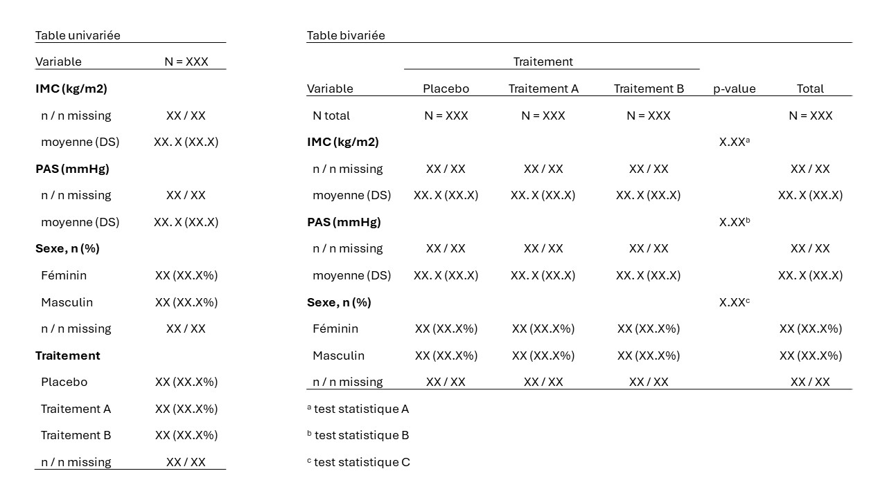

# Tableaux

Dans ce chapitre, nous présenterons quelques packages permettant d'obtenir des tables descriptives complètes, faciles à mettre en forme pour les intégrer dans un rapport d'analyse.

## Base d'exemple pour une analyse uni- et bivariée
Nous allons utiliser la base `df_1` déjà utilisées au sein de laquelle nous allons créer quelques données manquantes pour corser les choses !

```{r data_tableaux, echo=TRUE}
rm(list=ls())
## Import des données
df_1 <- read.csv2("data/df_1.csv")
meta_df_1 <- read.csv2("data/meta_df_1.csv")

# pour chaque variable, 10% des valeurs sont remplacées au hasard par des manquants
set.seed((6543))
df_1miss <- df_1
for (i in 2:ncol(df_1miss)) {
  df_1miss[[i]] <- ifelse(rbinom(n = nrow(df_1miss), size = 1, prob = 0.10) == 1, 
                          NA, df_1miss[[i]])
}
summary(df_1miss)

# on va créer des variables qualitatives au format factor pour le sexe et traitement
df_1miss$sexL <- factor(df_1miss$sex,
                        labels = meta_df_1$labs[meta_df_1$var == "sex"])
df_1miss$traitL <- factor(df_1miss$trait,
                          labels = meta_df_1$labs[meta_df_1$var == "trait"])

## pensez à vérifier que le recodage est correct
# table(df_1miss$sexL, df_1miss$sex)
# table(df_1miss$traitL, df_1miss$trait)

# mise à jour de la base de méta données
meta_df_1 <- rbind(meta_df_1, 
                   data.frame(var = "sexL", 
                              label = meta_df_1$label[meta_df_1$var == "sex"],
                              id_labs = names(table(as.numeric(df_1miss$sexL))),
                              code_labs = as.numeric(names(table(as.numeric(df_1miss$sexL)))),
                              labs = levels(df_1miss$sexL)))
meta_df_1 <- rbind(meta_df_1, 
                   data.frame(var = "traitL", 
                              label = meta_df_1$label[meta_df_1$var == "trait"],
                              id_labs = names(table(as.numeric(df_1miss$traitL))),
                              code_labs = as.numeric(names(table(as.numeric(df_1miss$traitL)))),
                              labs = levels(df_1miss$traitL)))
```

L'objectif sera de faire une table descriptive univariée de l'IMC, de la PAS, du sexe et du traitement. Puis, on fera une table bivariée de l'IMC, de la PAS et du sexe en fonction des groupes de traitement.

## Package `table1`
Le package [`table1`](https://cran.r-project.org/web/packages/table1/vignettes/table1-examples.html) permet de mettre facilement en forme des tableaux de statistiques descriptives uni- ou bivariées que l'on peut ensuite copier-coller dans un rapport (ou directement l'intégrer dans un rapport écrit avec Rmarkdown ou Quarto).

### Tables univariées
Une table univariée peut être obtenue avec une écriture au format `formula`, où les variables à décrire sont à gauche d'un signe `~` espacés de `+`. Voici un exmple ci-dessous
```{r table1_ex1, echo=TRUE, message=FALSE, warning=FALSE}
library(table1)
## Pour une analyse descriptive univariée
table1(~ imc + pas + traitL + sexL, data = df_1miss)
```

A noter que **par défaut, les données manquantes des variables catégorielles sont considérées comme une catégorie à part entière, et les pourcentages sont calculés en prenant en compte les manquants**. Par exemple pour le sexe, 45.7% + 46.7% + 7.7% = 100% en prenant en compte les 7.7% de données manquantes.

Généralement pour calculer les pourcentages, on préfèrera exclure les données manquantes.

Le package `table1` permet d'ajouter un nom de variable plus explicite aux variables :
```{r table1_ex2, echo=TRUE, message=FALSE, warning=FALSE}
## la fonction label() permet d'ajouter un nom de variable sous forme d'attribut
label(df_1miss$sexL) <- meta_df_1$label[meta_df_1$var == "sexL"][1]
label(df_1miss$traitL) <- meta_df_1$label[meta_df_1$var == "traitL"][1]
label(df_1miss$imc) <- meta_df_1$label[meta_df_1$var == "imc"]
label(df_1miss$pas) <- meta_df_1$label[meta_df_1$var == "pas"]

attributes(df_1miss$sexL)
attributes(df_1miss$imc)

## si on relance la fonction, les noms de variables explicites sont visibles
table1(~ imc + pas + traitL + sexL, data = df_1miss)
```

Il est possible de choisir plus spécifiquement quels paramètres afficher. Pour plus d'information sur les paramètres de distributions disponibles avec `table1`, vous pouvez chercher dans l'aide `?stats.default`.

```{r table1_render, echo=TRUE}
# par défaut, les variables continues sont présentées avec cet argument
render.continuous.default

# les variables catégorielles sont présentése avec cet argument
render.categorical.default
```

On peut créer de nouvelles fonctions de rendu en prenant ces deux fonctions pour modèle.
Ci-dessous, on va créer une fonction de rendu pour les variables quantitatives qui ne donne que la moyenne et la déviation standard entre parenthèses. 

Puis, on va créer une fonction de rendu pour les variables catégorielles qui calcule les pourcentages en excluant les données manquantes.
```{r table1_render_bis, echo=TRUE}
# fonction pour afficher uniquement la moyenne +/- écart type pour les variables
# quantitatives
render_var_quanti <- function(x) {   
  with(stats.default(x), 
       c("", 
         `Mean (SD)` = sprintf("%0.1f (%0.1f)", MEAN, SD)))
}

# fonction pour exclure les données manquantes pour le calcul des pourcentages
render_var_quali <- function (x, ..., na.is.category = FALSE) { # FALSE remplace TRUE
    c("",
      sapply(stats.apply.rounding(stats.default(x, ...), ...),
             function(y) with(y, sprintf("%s (%s%%)", FREQ,
                                         if (na.is.category) PCT else PCTnoNA)))) 
}

## on applique ensuite ces deux fonctions de rendus dans la fonction table1
table1(~ imc + pas + traitL + sexL, 
       data = df_1miss, 
       render.continuous = render_var_quanti, 
       render.categorical = render_var_quali)
```

A présent, on voit que pour le sexe, la somme 49.5% + 50.5% = 100%, la catégorie des manquants n'est pas prise en compte pour le calcul des pourcentages.

### Tables bivariées
Pour obtenir une table bivariée, on ajoute une barre verticale suivie d'une variable de format `factor`.
```{r table1_ex3, eval=FALSE, include=TRUE}
## Exemple de formule pour une table bivariée en fonction de traitL
table1(~ imc + pas + sexL | traitL, data = df_1miss)
# mais cet exemple ne fonctionne pas car la variable de stratification 
# ne doit pas contenir de données manquante +++

## Il faut donc exclure les lignes avec un traitement manquant dans la base
table1(~ imc + pas + sexL | traitL, 
       data = subset(df_1miss, subset = !is.na(traitL))) 
# la fonction subset a effacé les attributs "level" des noms de variables
``` 

```{r table1_ex4, , echo=TRUE}
## Pour ne pas supprimer les attibuts de variables, il vaut mieux utiliser
## la fonction filter du tidyverse (qui conserve les attributs)
table1(~ imc + pas + sexL | traitL, 
       data = dplyr::filter(df_1miss, !is.na(traitL))) 
```

Comme pour l'analyse univariée, on peut choisir de n'afficher que la moyenne et l'écart type pour les variables quantitatives et calculer les pourcentages en excluant les manquants pour les variables qualitatives.
```{r table1_ex5, , echo=TRUE}
table1(~ imc + pas + sexL | traitL, 
       data = dplyr::filter(df_1miss, !is.na(traitL)),
       render.continuous = render_var_quanti, 
       render.categorical = render_var_quali) 
```

Une des limites du package `table1` est qu'il ne permet pas d'afficher une colonne de p-values pour donner les résultats de tests de comparaison bivariés.

# Méthodes plus flexibles
Le package `table1` permet d'obtenir des tables uni- et bivariées très faciement, mais il ne donne pas beaucoup de possibilité pour adatper la table à sa guise. 

Pour obtenir des tables avec une plus grande liberté de présentation, on peut créer un tableau (`data.frame`) contenant exactement les résultats que l'on veut présenter.

Par exemple, on va chercher à obtenir une mise en forme comme celle de la figure ci-dessous :
```{r figtableaux, echo=FALSE, out.width="100%", fig.align="center", fig.cap="Formats souhaités"}
  
```


gt
gtsummary (basé sur gt)
table1

pour présenter un data.frame sous forme de table publiable
flextable
tinytable