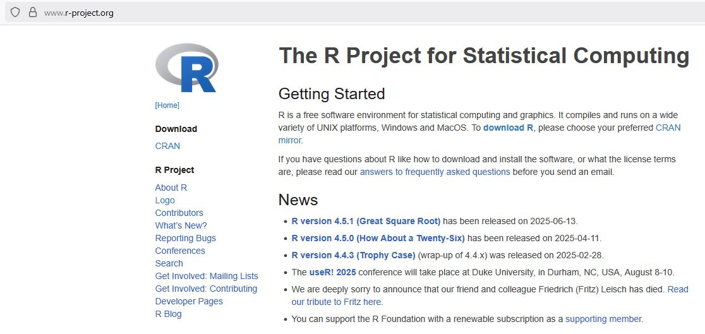
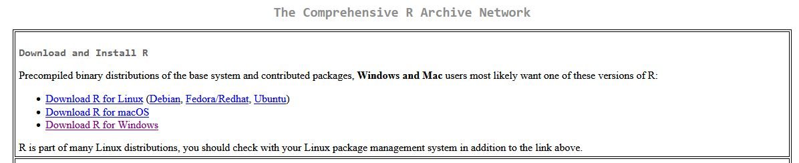
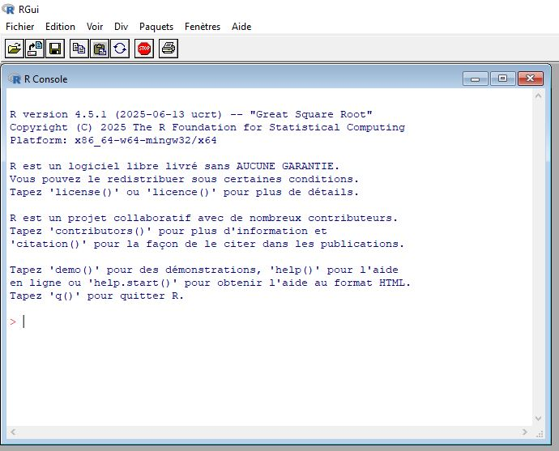
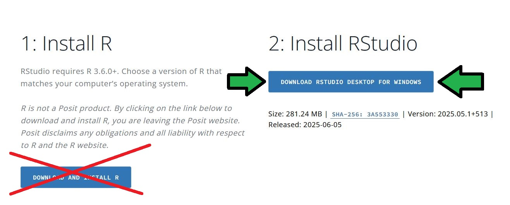
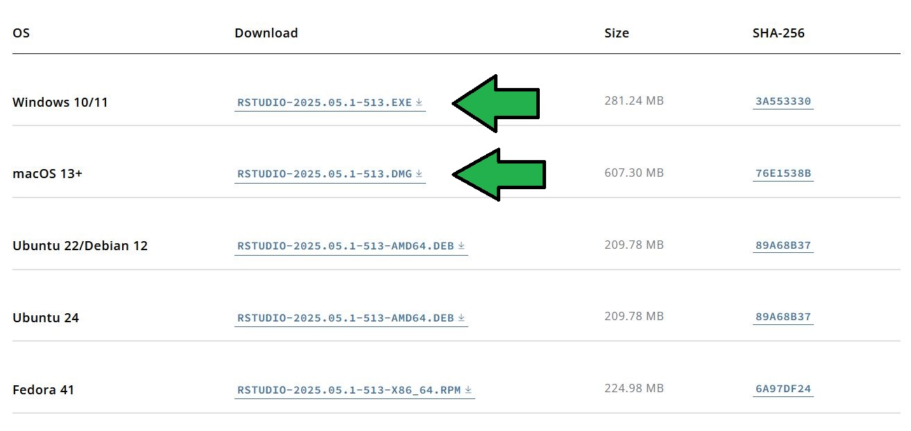
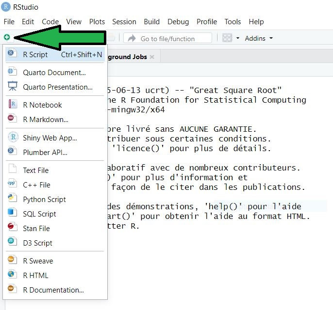
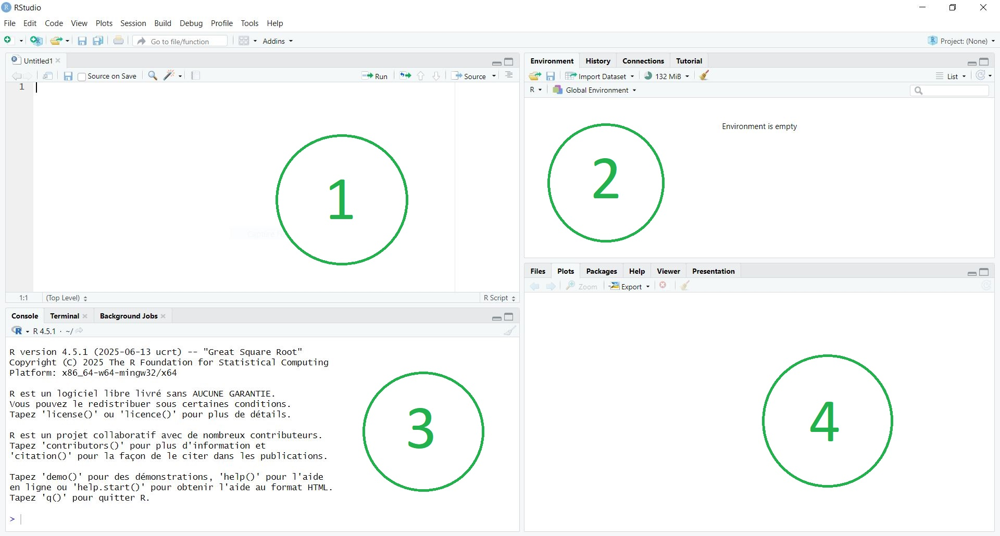

<!-- If you need PDF output, uncomment bookdown::pdf_book above in YAML. You will need a LaTeX installation, e.g., https://yihui.name/tinytex/ -->

```{r required, include=FALSE}
library(r2symbols)
```


# Bienvenue sur cette formation au logiciel R 

R est un logiciel accessible gratuitement permettant de réaliser des analyses statistiques dans un environnement windows, macOS ou Linux.

## Pourquoi choisir R ?
Le logiciel est gratuit, très complet, avec une communauté d'utilisateurs très active dans le monde entier. Il est fréquent que les nouvelles méthodes d'analyses statistiques développées dans les équipes académiques soient d'abord mises à disposition sur R.

Le logiciel R repose sur l'utilisation de **scripts** dans lesquels nous allons **programmer** les analyses statistiques. Cette écriture sous forme de programmation peut paraître austère à première vue, mais est indispensable pour permettre la **reproductibilité** et la **transparence** des analyses. La même démarche de programmation est utilisée dans tous les logiciels statistiques professionnels (Stata, SAS, Python, Matlab, etc).

Pour utiliser R, les premières choses à faire sont de :

 - télécharger le logiciel R 
 - et télécharger un Environnement de Développement Intégré (IDE) comme RStudio.

## Téléchargez le logiciel R
Vous pouvez télécharger la dernière version stable du logiciel R sur le site du [R project](https://www.r-project.org/). 
```{r dlR1, echo=FALSE, out.width="100%", fig.align="center", fig.cap="Site du R project, en juillet 2025"}
    
```
Cliquez sur "download R", choisissez un site mirroir (par exemple un des sites en France).

Puis téléchargez la version de R en fonction de votre système d'exploitation (Windows, macOS ou Linux).
```{r dlR2, echo=FALSE, out.width="100%", fig.align="center", fig.cap="Choisissez la version adaptée à votre système d'exploitation"}
    
```
Enfin, installez R à partir du fichier d'installation que vous venez de télécharger.

### Ouvrez le logiciel R
Si vous ouvrez le logiciel R, vous aller trouver l'interface graphique de R (_RGui_ pour _R Graphical user interface_). Il est possible de faire vos analyses statistiques à partir de cette interface graphique, mais elle est très très austère. 

```{r RGui, echo=FALSE, out.width="50%", fig.align="center", fig.cap="L'interface graphique de R (RGui)"}
    
```

Plutôt que d'utiliser cette interface RGui, nous vous recommandons fortement d'utiliser un Environnement de Développement Intégré (IDE), comme RStudio, qui vous facilitera grandement la vie pour utiliser un logiciel statistique qui repose sur de la programmation.

## Téléchargez un IDE (RStudio recommandé)
RStudio est un environnement qui permet d'utiliser R, mais également d'autres logiciels de programmation comme Python, SQL, Stan, C++, etc. Cet environnement vous facilitera le travail pour : 

 - éditer vos scripts de programmation, 
 - accéder à la console, 
 - visualiser vos environnements de travail avec les fichiers et les objets qu'il contient, 
 - visualiser vos sorties graphiques et certaines tables d'analyses, 
 - visualiser vos données, 
 - visualiser les fichiers d'aide, 
 - gérer les _packages_ permettant de faire des analyses spécifiques,
 - et bien d'autres choses encore.
 
Par exemple, le tutoriel que vous êtes en train de lire a été créé à partir du package [`bookdown`](https://bookdown.org/) avec le logiciels R, au sein de l'IDE RStudio, 

Vous pouvez télécharger la dernière version de [RStudio](https://posit.co/download/rstudio-desktop/) sur le site de la compagnie [Posit](https://posit.co/products/open-source/rstudio/?sid=1). Choisissez la version qui est adaptée à votre système d'exploitation (Windows, macOS ou Linux).
```{r dlRStudio, echo=FALSE, out.width="100%", fig.align="center", fig.cap="téléchargez RStudio"}
  
    
```
Puis, installez RStudio à partir du fichier d'installation que vous venez de télécharger.

### Ouvrez l'IDE RStudio
Ouvrez RStudio, puis commencez par ouvrir un **script** 

 - à partir du menu File > New File > R script
 - ou bien en utilisant le raccourci Ctrl+Maj+N sur windows
 - ou bien en cliquant sur le petit fichier blanc avec un + vert en haut à gauche, puis choisir "R script"

```{r newscript, echo=FALSE, out.width="50%", fig.align="center", fig.cap="Ouvrir un nouveau script"}
  
```

L'interface de RStudio contient un menu, 4 quadrants et des sous-menus et boutons dans chaque cadrant.

```{r RStudcadrants, echo=FALSE, out.width="100%", fig.align="center", fig.cap="Les 4 cadrants de RStudio"}
  
```

Les menus qui vous seront le plus utiles sont :

  - Dans le menu principal, 
    - le menu _File_ vous permettra de créer de nouveaux fichiers, d'ouvrir des fichiers déjà existants, de sauver vos fichiers, d'importer des bases de données, etc.
    - le menu _Tools > Install packages..._ pour installer de nouveaux packages
    - le menu _Tools > Global Options..._ vous permet de choisir la version du logiciel R à utiliser (onglet "R General") ou bien de changer l'aspect graphique de l'environnement RStudio (onglet "Appearance", puis choisissez un "Editor theme", avec différentes interfaces claires ou sombres)

  - Au sein du **script** (cadrant 1) 
    - le bouton "disquette" permet de sauvegarder votre script
    - le bouton "run" permet de faire tourner votre programme d'analyse (les lignes que vous avez sélectionnées). Par exemple, tapez la commande suivante dans le script, sélectionnez la ligne et cliquez sur le bouton "run" (ou avec un raccourci clavier `ctrl`+`entrée` sur windows, ou encore `command`+`entrée` sur macOS).

```{r test1, eval=FALSE, include=TRUE}
print("Hello Toulouse")
``` 
et vous devriez voir la commande `> print("Hello Toulouse")` puis son résultat `"Hello Toulouse"` dans l'onglet **console** du cadrant 3.

  - Au sein du cadrant 3, l'onglet le plus utile pour pour les débutants est l'onglet **console**
    - la console est la même que la console affichée dans l'interface RGui du logiciel R que l'on a vu au paragraphe 1.2.1.
    - la console commence par afficher la version de R en cours d'utilisation
    - vous pouvez y saisir des commandes et obtenir directement leurs résultats, par exemple si vous tapez dans la console `4+9`, vous obtiendrez directement le résultat `13`. **Attention, les commandes que vous saisissez directement dans la console ne seront pas sauvegardées. Si vous voulez sauvegarder des commandes, il faut utiliser le _script_ (cadrant 1)**
    
```{r test2, echo=TRUE}
4+9
``` 

  - Au sein du cadrant 2, l'onglet le plus utile pour les débutants est l'onglet **Environment**
    - cet onglet vous permettra de visualiser les "objets R" créés pendant vos analyses. 
    - Par exemple si vous saisissez `v <- 1:10` dans la console, vous allez voir apparaître l'objet `v` dans l'environnement de travail (il s'agit d'un vecteur de 1 à 10, nommé "v").
    
  - Au sein du cadrant 4, les onglets les plus utiles pour les débutants sont : 
    - l'onglet "File" qui contient les dossiers et fichiers au sein d'un dossier de travail (voir le chapitre 3 pour créer et organiser un dossier de travail associé à un "projet R")
    - l'onglet "Plots" où vous retrouverez vos sorties graphiques. Au sein de cet onglet, vous trouverez un menu pour exporter vos graphiques selon différents formats. Des boutons permettent également de zoomer et d'effacer les graphiques. Par exemple, si vous saisissez `hist(rnorm(10000))` dans la console, un histogramme d'une distribution normale centrée réduite va apparaître. Vous pouvez effacer la figure en cliquant sur le bouton avec la croix rouge (efface la figure actuelle) ou le balet (efface l'ensemble des figures). 
    - l'onglet "Packages" où vous pourrez activer, désactiver ou mettre à jour les packages qui ont été téléchargés.
    - l'onglet "Help" où vous trouverez de l'aide. Par exemple si vous saisissez `help(mean)` dans la console, l'aide de la commande `mean` va s'afficher. Vous pouvez également utiliser le champ de recherche de fonctions dans le menu "Help".


## Trouver de l'aide sur R
De nombreuses ressources sont disponibles pour vous aider à utiliser R : 

  - Les pages d'aide en ligne de R, qui apparaîssent directement dans RStudio. Vous pouvez obtenir de l'aide sur des fonctions et des packages : 
    - en appliquant une recherche par mot clé dans le champ de recherche de l'onglet "help"
    - en utilisant directement dans la console la fonction `help.search()` ou `??` associée à un mot clé (par exemple `help.search(student)` ou `??student`), ou la fonction `help()` associée à une fonction (par exemple `help(t.test)` ou `?t.test`)
    - Ces pages d'aide suivent la structure suivante : 
      - une partie "Description" qui décrit en quelques phrases ce que fait la fonction
      - une partie "Usage" qui décrit la syntaxe de la fonction avec ses arguments
      - une partie "Argument" qui précise comment renseigner les arguments de la fonction
      - une partie "Detail" qui décrit en détail comment utiliser la fonction et ses arguments
      - une partie "Value" qui décrit les sorties (les résultats) de la fonction, avec les éventuels sous-objets de la sortie
      - une partie "Exemples" qui indique quelques exemple que vous pouvez directement lancer en cliquant sur "Run examples"
  
  - Des fiches "mémoires" _cheat sheets_ qui résument les principales fonctions : 
    - pour les [commandes R bases](https://rstudio.github.io/cheatsheets/base-r.pdf)
    - des [bonnes pratiques sur R](https://rstudio.github.io/cheatsheets/R-best-practice.pdf)
    - méthodes de visualisation avec le package [ggplot2](https://posit.co/wp-content/uploads/2022/10/data-visualization-1.pdf)
    - l'utilisation du package [data.table](https://rstudio.github.io/cheatsheets/datatable.pdf)
    - l'utilisation du package [dplyr](https://dplyr.tidyverse.org/) et sa [fiche dplyr](https://github.com/rstudio/cheatsheets/blob/main/data-transformation.pdf)
    - l'utilisation du package [stringr](https://rstudio.github.io/cheatsheets/html/strings.html) pour manipuler les chaînes de caractères, avec la [fiche stringr](https://rstudio.github.io/cheatsheets/strings.pdf) 
    - la manipulation de dates [Dates and times with lubridate](https://rstudio.github.io/cheatsheets/html/lubridate.html) et la [fiche lubridate](https://rstudio.github.io/cheatsheets/lubridate.pdf)
  - De nombreux livres et tutoriels disponibles gratuitement en ligne :
    - Le [guide R](https://larmarange.github.io/guide-R/) de Joseph Larmarange, est un guide très complet et didactique, en français
    - L'[Epidemiologist R Handbook](https://epirhandbook.com/en/index.html) est un tutoriel en anglais pour l'utilisation de R par des épidémiologistes
    - Software carpentry met à disposition des guides introductifs bien réalisés en anglais, par exemple [R for Reproducible Scientific Analysis](https://swcarpentry.github.io/r-novice-gapminder/) ou encore [Programming with R](https://swcarpentry.github.io/r-novice-inflammation/)
    - le livre [R for Data Science](https://r4ds.hadley.nz/) propose une introduction très complète pour l'analyse de données descriptive principalement basée sur la suite de packages du [Tidyverse](https://www.tidyverse.org/)
    - le package R [swirl](https://swirlstats.com/) propose une formation interactive directement dans la console de RStudio, téléchargez le package (`install.packages("swirl")`), chargez le package (`library("swirl") `) et laissez vous guider après avoir saisi `swirl()` dans la console.
    - [RStudio Education](https://education.rstudio.com/learn/beginner/) liste plusieurs ressources intéressantes pour les débutants
    - Le site CRAN a des manuels assez complets, par exemple la page [R Language Definition](https://cran.r-project.org/doc/manuals/R-lang.html) est une introduction assez complète au langage de programmation R. La page [CRAN Task Views](https://cran.r-project.org/web/views/) liste les packages qui sont disponibles par thématique ou type d'anlayse.
    
  - Rechercher à l'aide d'un moteur de recherche (google, DuckDuckGo, Bing, etc). Ces recherches vous amèneront régulièrement vers des forums de discussion comme [stackoverflow](https://stackoverflow.com/questions/tagged/R) ou [stackExchange](https://stats.stackexchange.com/questions/tagged/r). Si vous rencontrez une erreur ou une difficulté, il y a toutes les chances que d'autres personnes aient déjà rencontré ces erreurs et difficultés avant vous, et que des solutions détaillées soient proposées dans ces forums.
  
  - Les chatbots de type GPT, Copilot ou Gemini : dans le cadre de votre formation au logiciel R, nous vous déconseillons l'utilisation de ces outils basés sur des LLM. Ces outils posent de nombreux problèmes en termes de transparence, de respect de droit d'auteur, d'impact environnemental, de déqualification (délegation de compétences pour rechercher de l'information, perte d'esprit critique), de dépendance aux Gafams, de dégradation des systèmes d'information, etc. Par ailleurs, bien qu'ils peuvent apporter des solutions fonctionnelles, il est bien plus utile d'avoir une bonne compréhension des bases de programmations sur R avant d'utiliser de tels outils : sans une bonne compréhension de la logique de programmation et des principales fonctions de R, vous aurez des difficultés à évaluer la fiabilité des solutions proposées, à vous débloquez en cas de problèmes, ou encore à adapter vos prompts pour obtenir de meilleures réponses. Les ressources décrites précédemment devraient vous permettre d'apporter efficacement des réponses à vos questions.
  
## Conventions d'écriture
Certaines conventions ont été proposées pour faciliter l'écriture et la lecture du code de programmation dans R. Elles ne sont pas obligatoires, mais nous vous encourrageons à les suivre.

Par exemple, le [_Tidyverse style guide_](https://style.tidyverse.org/) : 
  
  - nommer les variables et les fonctions en lettres minuscules, à l'aide de mots et de chiffres séparés par `_` (_underscore_). Par exemple `csp_1`. Cette convention fait référence au style ["snake case"](https://en.wikipedia.org/wiki/Snake_case)
  - ajouter un espace après une virgule, par exemple `x[2, 5]`
  - ajouter des espaces avant et après les opérateurs arithmétiques, par exemple `x <- (1 + 2) / 5`, à quelques exceptions près (pas d'espace avant ou après le signe "puissance" `^`) `y <- x^2 + 3` 
